# 🌍 Who Survives the Shock?
## Global Crisis & Resilience Analysis Dashboard

An end-to-end Data Analytics project that explores how countries and regions respond to global shocks through multiple dimensions including Economic Stability, Food Security, Digital Infrastructure, Healthcare, Climate & Energy, and Political Stability.

The project combines World Bank indicators, FAO Food Price data, Healthcare metrics, Digital Transformation indicators, and Political Stability measures into a unified analytical model to uncover hidden patterns of resilience and fragility across 100 countries between 2000 and 2023.

---

# 📌 Project Story

Global crises rarely occur in isolation.

A food crisis affects healthcare outcomes.

Political instability accelerates medical brain drain.

Digital exclusion limits economic growth.

Energy poverty intensifies food insecurity.

This project was designed to answer one question:

> Which countries are merely surviving global shocks, and which are truly resilient?

---

# 🎯 Objectives

- Measure global resilience using a multi-domain approach
- Identify vulnerable countries and regions
- Analyze long-term trends from 2000–2023
- Detect hidden relationships between global indicators
- Build an interactive storytelling dashboard
- Generate actionable insights supported by statistical evidence

---

# 🛠️ Tools Used

- Excel
- Power Query
- Power Pivot
- DAX
- Data Modeling
- Dimensional Modeling
- Statistical Analysis
- Data Visualization

---

# 🏗️ Data Model

The project follows a Galaxy Schema architecture.

## Schema

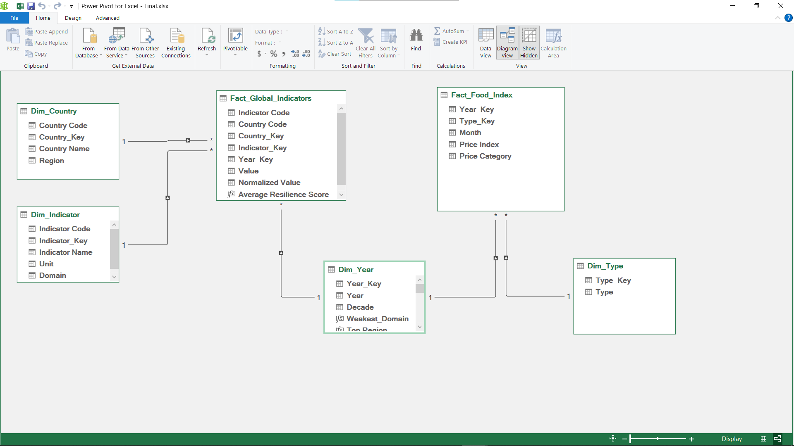

---

## Fact Tables

### Fact_Global_Indicators

Contains:

- Indicator Values
- Normalized Values
- Country Keys
- Indicator Keys
- Year Keys

### Fact_Food_Index

Contains:

- Food Price Index
- Price Categories
- Month
- Year

---

## Dimension Tables

### Dim_Country
- Country
- Region

### Dim_Year
- Year
- Decade

### Dim_Indicator
- Indicator Name
- Domain
- Unit

### Dim_Type
- Food Category

---

# 🧹 Data Cleaning & Transformation

## Data Integration

- Combined multiple datasets using `Table.Combine()`
- Unified all indicators into a single analytical structure

## Data Filtering

- Removed years 2024 and 2025
- Filtered selected countries only
- Excluded:
  - Egypt, Arab Rep.
  - Israel

## Data Type Conversion

- Converted columns to proper data types
- Numeric
- Text
- Date

## Date Engineering

Created:

- Year
- Month
- Decade

## Data Reshaping

- Renamed indicators
- Applied Unpivot transformation
- Converted wide tables into analytical long format

## Duplicate Removal

- Removed duplicates while creating dimensions

## Surrogate Keys

Generated:

- Country_Key
- Year_Key
- Indicator_Key
- Type_Key

using Index Columns.

## Indicator Standardization

- Cleaned indicator names
- Extracted units
- Removed unnecessary symbols

## Country Classification

Countries were grouped into:

- Africa
- Europe
- Middle East
- East Asia
- South Asia
- Central Asia
- North America
- South America
- Oceania
- Central America & Caribbean

## Indicator Classification

Indicators were grouped into:

- Economic Fragility
- Food Security
- Digital Infrastructure
- Healthcare
- Political Stability
- Climate
- Energy

## Food Classification

Created custom categories:

- Extremely Cheap
- Very Cheap
- Cheap
- Slightly Cheap
- Below Normal
- Near Normal
- Slightly Expensive
- Moderately Expensive
- Expensive
- Very Expensive

---

# 📊 Data Normalization

To make indicators comparable across different scales:

```text
Normalized Value =
0.01 + ((Value - Min) / (Max - Min)) × 0.99
```

## 🔄 Direction Adjustment

For indicators where lower values represent better outcomes, the normalized score was reversed using:

```text
Adjusted Score = 1 - Normalized Value
```

Examples:

- Inflation
- Prevalence of Undernourishment
- Government Debt

---

# 🌍 Dashboard Pages

## 🏠 Home Page

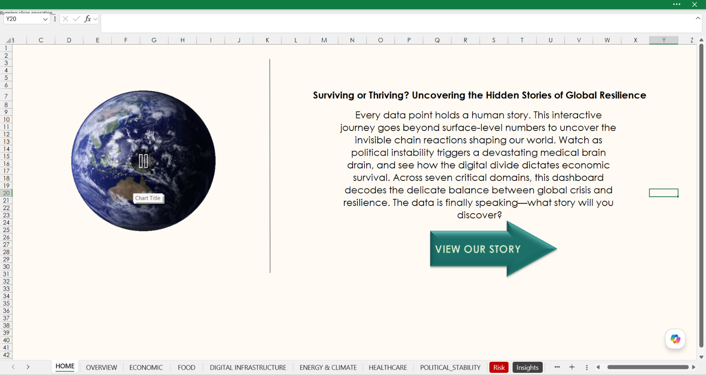

Project landing page introducing the story-driven analytics journey.

---

## 📈 Overview Dashboard

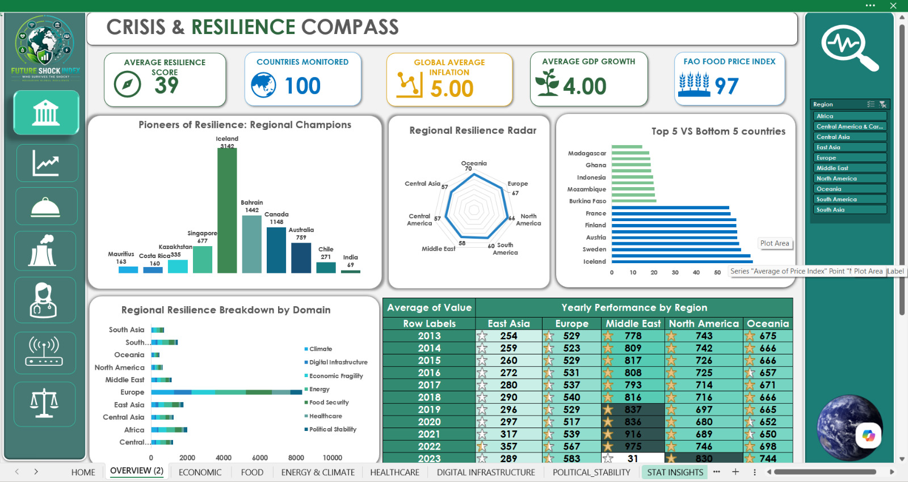

### Key KPIs

- Average Resilience Score
- Countries Monitored
- Global Average Inflation
- Average GDP Growth
- FAO Food Price Index

### Purpose

Provides a high-level view of global resilience performance and regional comparisons across all domains.

---

## 💰 Economic Fragility Dashboard

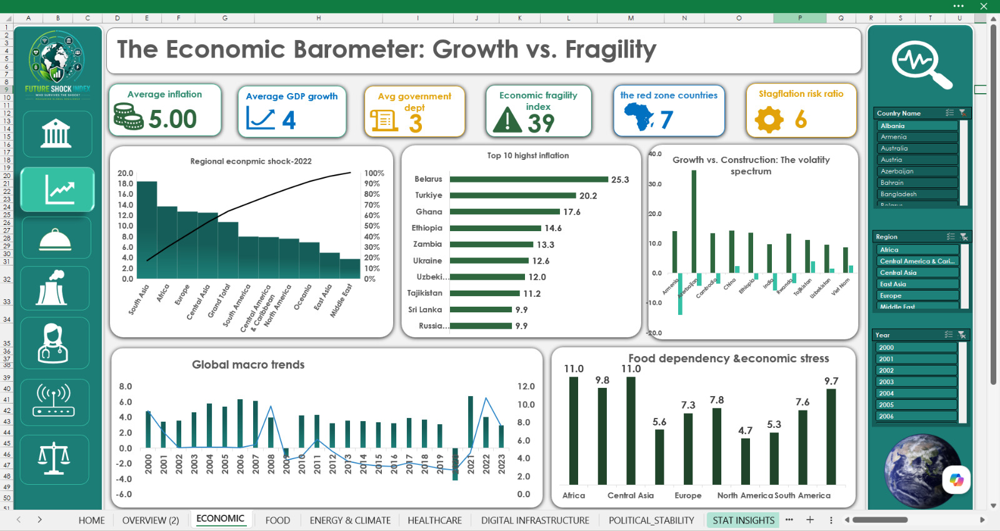

### Analyzes

- Inflation
- GDP Growth
- Government Debt
- Economic Fragility Index

### Focus

Evaluates macroeconomic stability and identifies regions most vulnerable to economic shocks.

---

## 🍽️ Food Security Dashboard

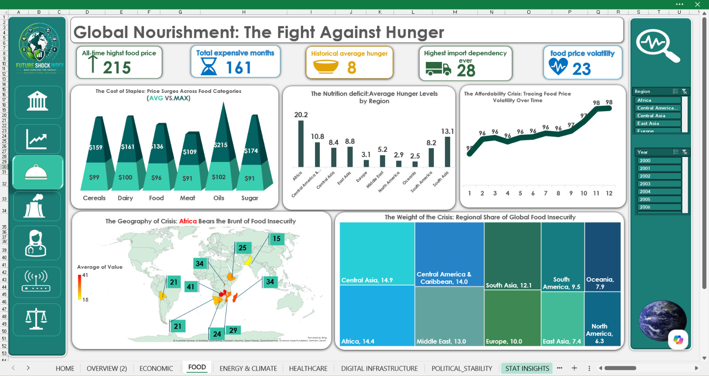

### Analyzes

- Food Price Volatility
- Hunger Levels
- Food Import Dependency
- Global Food Insecurity

### Focus

Examines food affordability, nutritional challenges, and vulnerability to food crises.

---

## 🌐 Digital Infrastructure Dashboard

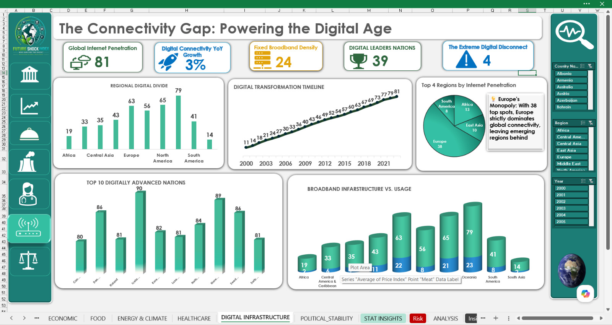

### Analyzes

- Internet Penetration
- Broadband Density
- Connectivity Gaps
- Digital Leaders

### Focus

Measures global digital readiness and highlights the digital divide between regions.

---

## ⚡ Energy & Climate Dashboard

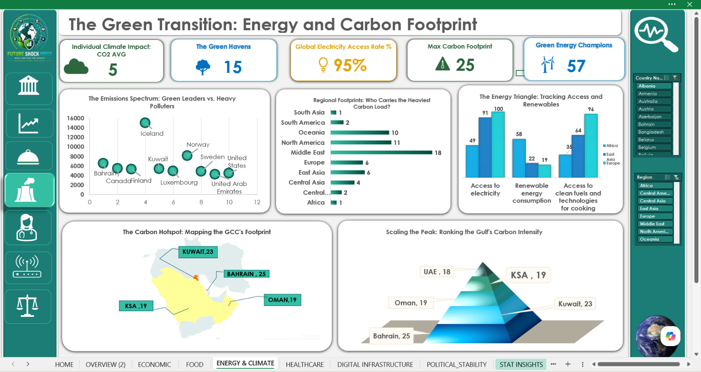

### Analyzes

- Carbon Footprint
- Renewable Energy Adoption
- Electricity Access
- Climate Readiness

### Focus

Explores sustainability performance and the transition toward cleaner energy systems.

---

## 🏥 Healthcare Dashboard

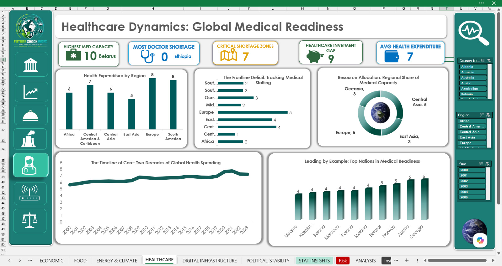

### Analyzes

- Health Expenditure
- Medical Capacity
- Physician Availability
- Healthcare Gaps

### Focus

Assesses healthcare readiness and the ability of nations to withstand public health challenges.

---

## ⚖️ Political Stability Dashboard

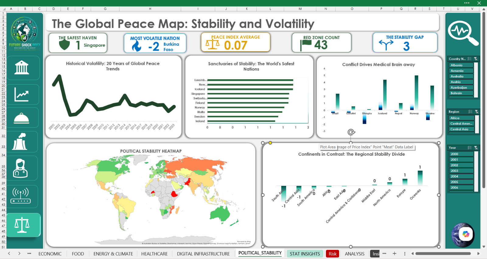

### Analyzes

- Stability Trends
- Political Volatility
- Safe Countries
- Political Risk

### Focus

Evaluates governance quality and its influence on long-term resilience.

---

# 💡 Business Insights

## Overview & Domain Insights

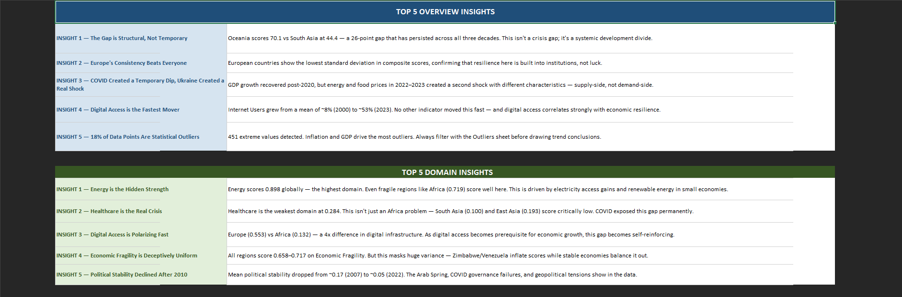

### Key Highlights

- Europe demonstrates the strongest resilience consistency.
- Digital Infrastructure is the fastest-improving domain.
- Healthcare remains the weakest global domain.
- Political Stability has shown a long-term decline since 2010.
- Regional resilience differences are structural rather than temporary.

---

## Risk & Food Insights

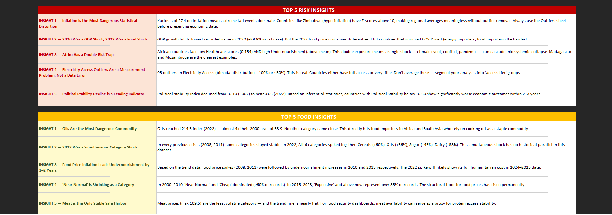

### Key Highlights

- Inflation is the most dangerous economic distortion.
- Africa faces a double-risk trap driven by healthcare and food insecurity.
- Food price inflation often precedes increases in undernourishment.
- The 2022 crisis represented an unprecedented global food shock.
- Political instability acts as a leading indicator of future economic stress.

---

# 📑 Statistical Insights

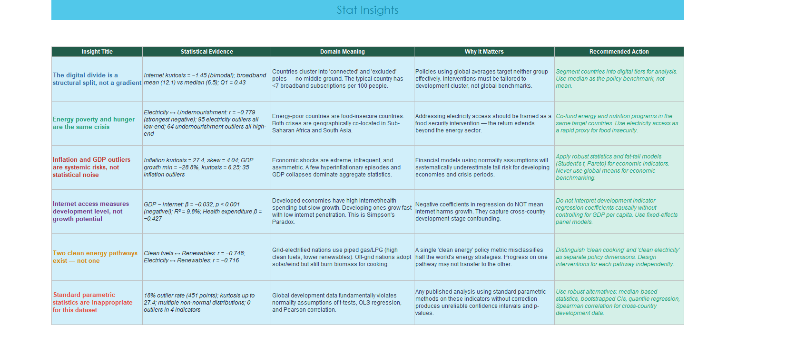

### Key Findings

- The digital divide is structural rather than gradual.
- Energy poverty and hunger are strongly interconnected.
- Inflation outliers create significant systemic risk.
- Internet access reflects development levels more than growth potential.
- Multiple indicators exhibit non-normal distributions and extreme outliers.
- Standard parametric assumptions perform poorly on this dataset.
- Robust statistical methods are recommended for analysis.

---

# 🚀 Project Outcome

The final solution delivers:

✅ Interactive analytical dashboards

✅ Multi-domain resilience scoring framework

✅ Cross-domain storytelling and exploration

✅ Statistical insight generation

✅ Global risk identification framework

✅ Decision-support analytics for policymakers and researchers

✅ Regional and country-level benchmarking

✅ Longitudinal analysis covering 2000–2023

✅ Star Schema data model optimized for analytics

---

# 📈 Key Results & Recommendations

## Key Results

- Built a multi-domain resilience scoring framework covering 100 countries.
- Integrated economic, food, healthcare, energy, climate, digital, and political indicators into a unified analytical model.
- Developed interactive dashboards for regional and country-level analysis.
- Identified significant structural resilience gaps across regions.
- Generated business and statistical insights supported by normalized indicators and trend analysis.

## Recommendations

### 🌐 Accelerate Digital Inclusion

Regions with low internet penetration and broadband density should prioritize digital infrastructure investments to reduce economic vulnerability and improve resilience.

### 🏥 Strengthen Healthcare Capacity

Countries with persistent healthcare shortages should increase healthcare expenditure, expand medical workforce capacity, and improve access to essential health services.

### 🍽️ Reduce Food Import Dependency

Highly import-dependent countries should diversify food supply chains and strengthen domestic agricultural production to improve food security.

### ⚡ Expand Energy Accessibility

Improving electricity access and investing in renewable energy can simultaneously enhance economic resilience, reduce poverty, and support environmental sustainability.

### ⚖️ Improve Governance & Stability

Political stability emerged as a leading resilience factor. Strengthening institutions, transparency, and governance frameworks can reduce long-term systemic risk.

### 📊 Adopt Data-Driven Policymaking

Governments and development organizations should leverage integrated resilience monitoring frameworks to identify emerging risks early and allocate resources more effectively.
