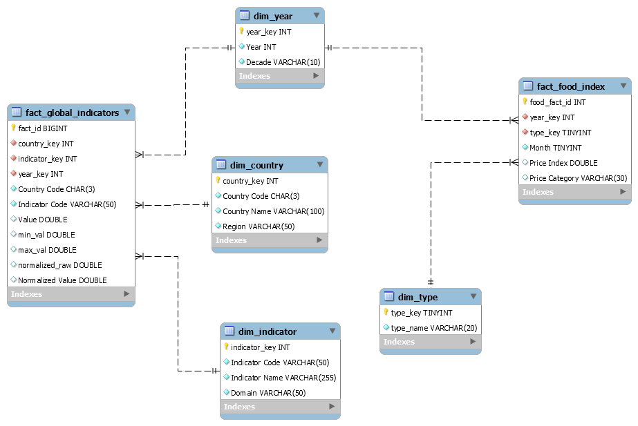

# 🌍 Global Resilience Analytics Project (MYSQL)

> A comprehensive SQL analytics project that evaluates resilience, risk, food security, healthcare capacity, economic stability, and future preparedness across 100 countries between 2000 and 2023.

---

# 📖 Project Overview

The Global Resilience Analytics Project was developed to measure how countries respond to economic, political, environmental, healthcare, and food-security challenges.

Using data from the World Bank and FAO, the project integrates multiple datasets into a unified analytical model that enables country ranking, regional comparison, trend analysis, and risk assessment.

The objective is not only to store data but to transform it into actionable insights that help identify resilient countries, vulnerable regions, and long-term global patterns.

---

# 🎯 Analytical Objective

Traditional economic indicators alone cannot fully explain how resilient a country is when facing crises.

This project answers questions such as:

* Which countries are the most resilient?
* Which countries face the highest risk?
* Which regions perform best across resilience domains?
* What are the main drivers of vulnerability?
* How has resilience changed over time?
* Which countries are most prepared for future shocks?

---

# 🗂️ Data Sources

### World Bank Indicators

* Fixed Broadband Subscriptions
* Internet Users
* GDP Growth
* Inflation
* Food Imports
* Prevalence of Undernourishment
* Health Expenditure
* Hospital Beds
* Physicians
* Political Stability
* Access to Electricity
* Access to Clean Fuel
* CO₂ Emissions
* Renewable Energy
* Electricity Consumption

### FAO

* Food Price Index
* Dairy Index
* Cereals Index
* Oils Index
* Meat Index
* Sugar Index

---

# 🏗️ Data Architecture


The project follows a dimensional modeling approach using a Galaxy Schema.

### Fact Tables

#### Fact_Global_Indicators

Stores all resilience indicators and calculated measures.

#### Fact_Food_Index

Stores food price index metrics across years and commodity types.

---

### Dimension Tables

#### Dim_Country

* Country Key
* Country Name
* Country Code
* Region

#### Dim_Indicator

* Indicator Code
* Indicator Name
* Domain

#### Dim_Year

* Year
* Decade

#### Dim_Type

* Commodity Type

---

# 🔄 Data Preparation

The data preparation process included:

* Data Cleaning
* Data Validation
* Country Standardization
* Region Mapping
* Missing Value Handling
* Domain Classification
* Min-Max Normalization
* Indicator Transformation

---

# 🧮 Resilience Methodology

To compare indicators with different scales, Min-Max Normalization was applied.

```text
0.01 + ((Value - Min) / (Max - Min)) × 0.99
```

For inverse indicators such as:

* Inflation
* Undernourishment
* Food Dependency

the score is reversed to ensure that higher values always indicate stronger resilience.

---

# 📊 Analytical Areas

### 🌍 Country Ranking Analysis

Ranks countries according to their composite resilience score.

Key outputs:

* Top Performing Countries
* Lowest Performing Countries
* Resilience Tiers

---

### 🗺️ Regional Analysis

Compares resilience performance across world regions.

Key outputs:

* Best Region
* Weakest Region
* Regional Ranking
* Regional Improvement

---

### 📈 Trend Analysis

Analyzes resilience changes from 2000–2023.

Key outputs:

* Global Trend
* Regional Trend
* Decade Comparison
* Growth Patterns

---

### ⚠️ Risk Analysis

Identifies vulnerable countries and regions.

Key outputs:

* High-Risk Countries
* Political Instability Analysis
* Economic Fragility Assessment
* Vulnerability Classification

---

### 🌾 Food Security Analysis

Evaluates food-related resilience.

Key outputs:

* Food Dependency
* Undernourishment
* Food Vulnerability
* Commodity Price Shocks

---

### ⚡ Future Shock Analysis

Measures preparedness for future disruptions.

Key outputs:

* Future Shock Index
* Resilience Gaps
* Long-Term Sustainability Assessment

---

# 📏 Key Measures

Examples of calculated metrics include:

* Composite Resilience Score
* Regional Resilience Score
* Domain Average Score
* Food Vulnerability Score
* Food Dependency Rate
* Risk Score
* Stability Score
* Decade Improvement Score
* Future Shock Index

---

# 💡 Insights Uncovered by the Analysis

The analysis revealed several important patterns across countries, regions, and resilience domains:

### 🌍 Resilience Is Not Determined by Economic Strength Alone

Several countries with strong economic performance did not rank among the most resilient due to weaknesses in healthcare capacity, political stability, or food security. This highlights the importance of a balanced resilience profile rather than relying solely on economic growth.

---

### 🏥 Healthcare and Political Stability Are Major Drivers of Resilience

Countries with strong healthcare systems and stable governance consistently achieved higher composite resilience scores, regardless of geographic region.

---

### 🌾 Food Security Remains a Critical Global Vulnerability

Many countries showed significant dependence on food imports and were highly exposed to food price volatility, making food security one of the most influential risk factors in the resilience framework.

---

### 🗺️ Significant Regional Disparities Exist

The analysis revealed substantial differences in resilience performance across regions. While some regions demonstrated balanced strength across multiple domains, others showed persistent structural weaknesses.

---

### 📈 Resilience Has Improved Over Time

Comparing the 2000s, 2010s, and 2020s indicates that overall resilience levels improved globally, although progress was uneven across countries and domains.

---

### ⚠️ Hidden Vulnerabilities Can Exist Behind Strong Overall Scores

Some countries achieved high composite scores while still exhibiting weaknesses in specific domains, suggesting that strong overall performance does not necessarily eliminate future risk exposure.

---

### ⚡ Future Preparedness Varies Significantly Across Countries

The Future Shock Analysis showed that countries with diversified strengths across digital infrastructure, healthcare, governance, and sustainability are better positioned to absorb future global disruptions.

---

### 🔍 Multi-Domain Weaknesses Create Systemic Risk

Countries that perform poorly across several domains simultaneously face disproportionately higher risk levels than countries with isolated weaknesses, emphasizing the interconnected nature of resilience.

---


# 🛠️ Technologies Used

* SQL
* MySQL
* MySQL Workbench
* Dimensional Modeling
* Data Warehousing
* Analytical SQL
* Business Intelligence Concepts

---

# 📂 Module Structure

```text
Global-Resilience-Analytics/
│
├── SQL_Project_final.sql
├── Model.mwb
├── README.md
└── schema.png
```
