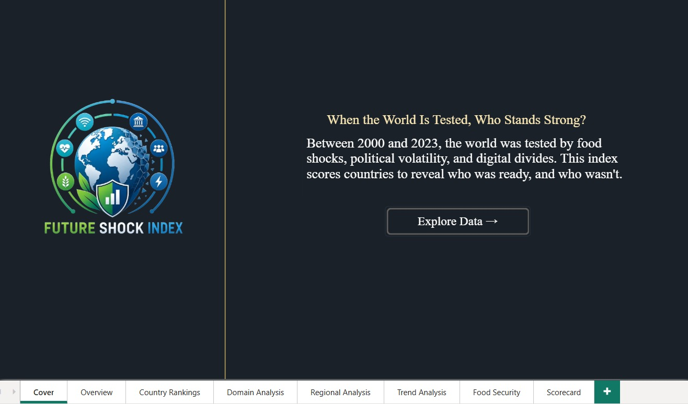
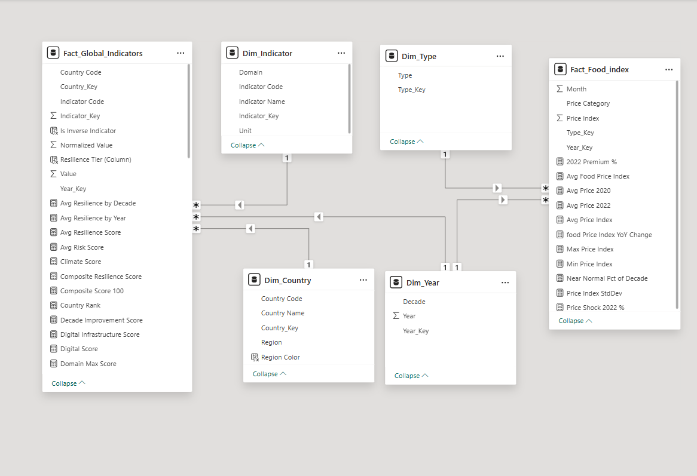
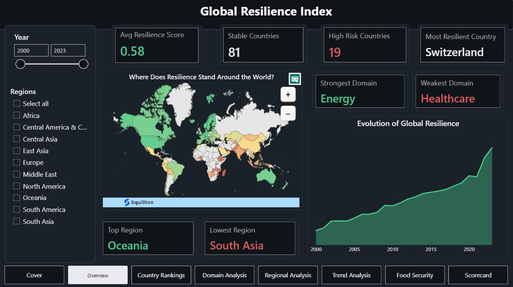
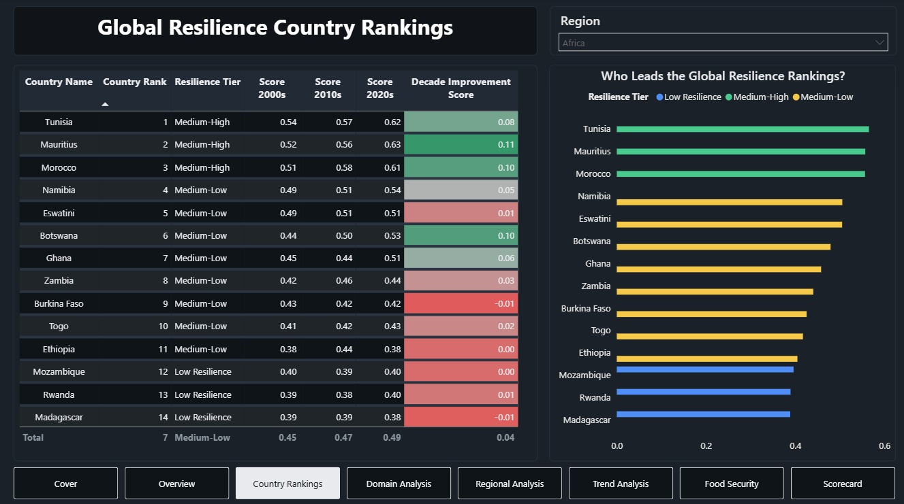
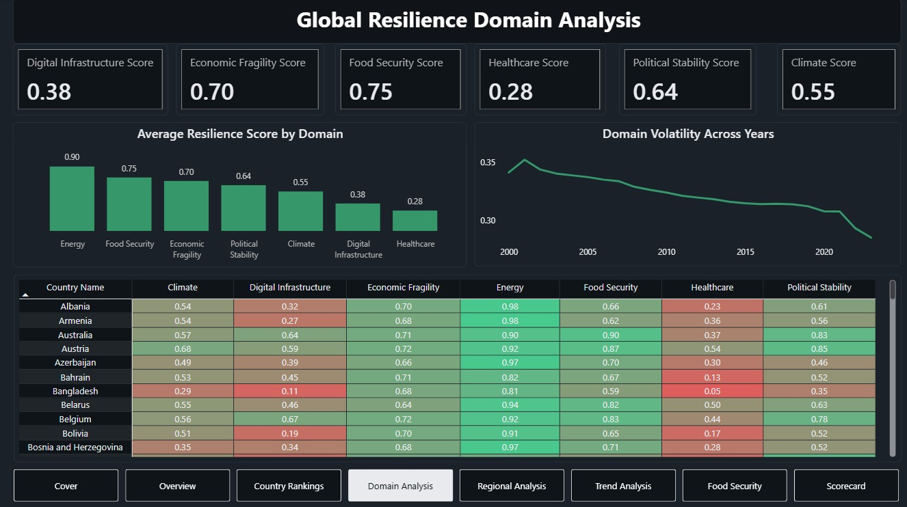
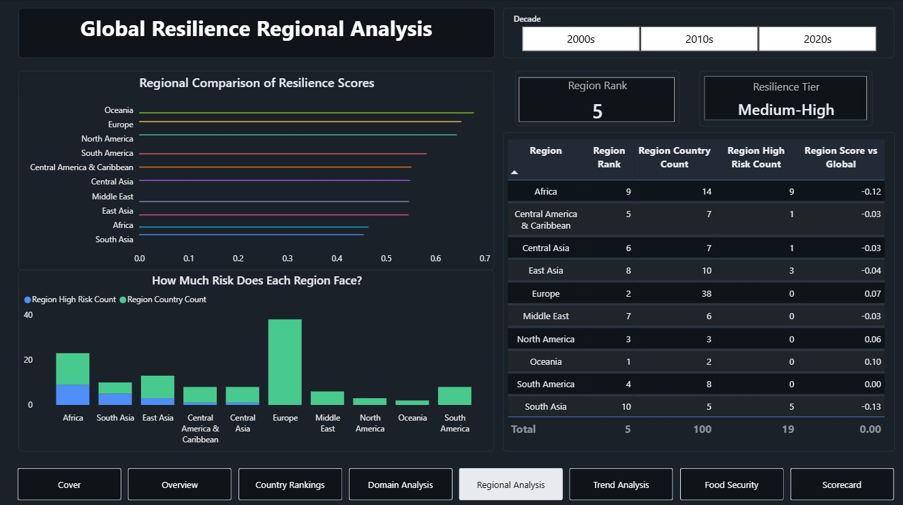
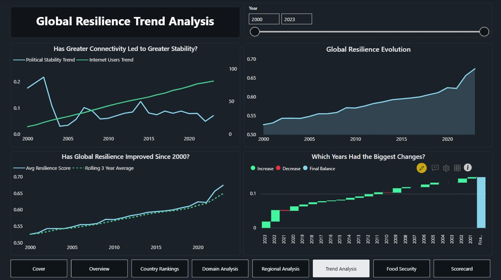
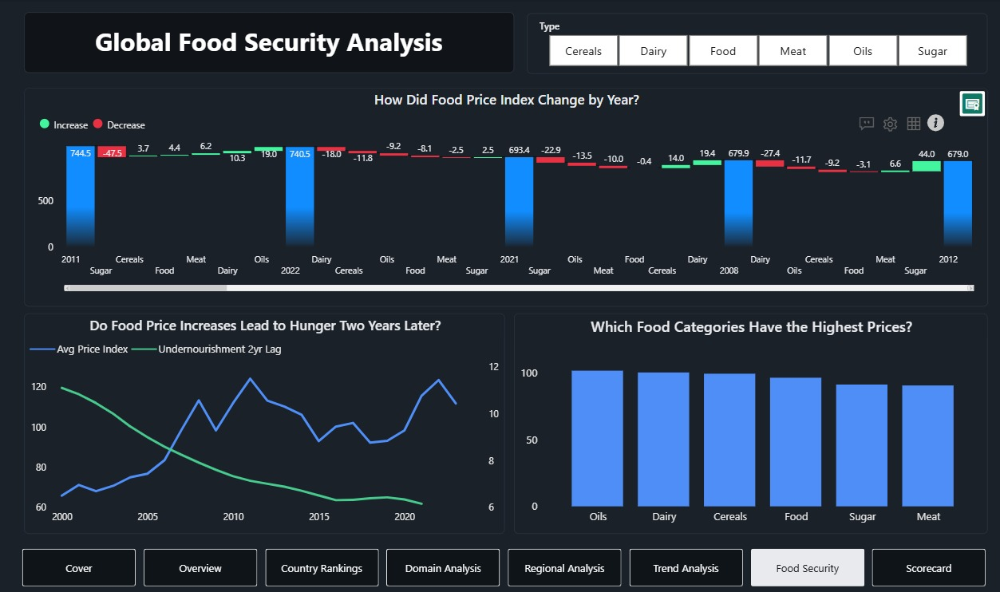
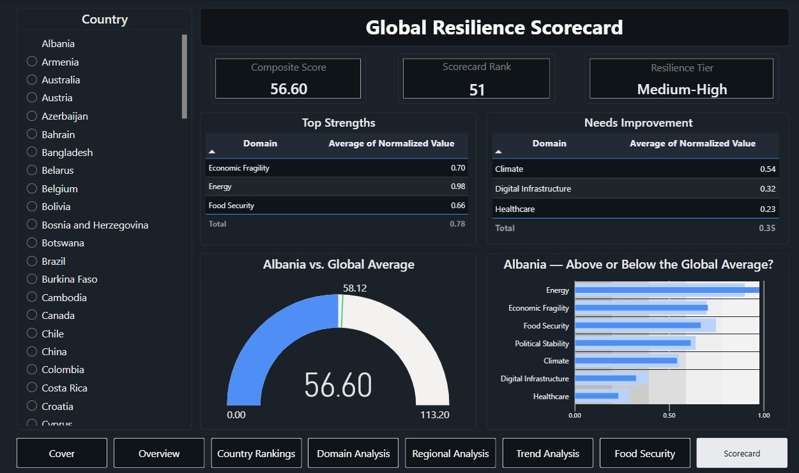

# 🌍 Global Resilience Index (Power BI)



> **When the world is tested, who stands strong?**
>
> The Global Resilience Index is an end-to-end Business Intelligence project that evaluates how countries withstand economic, political, environmental, healthcare, and food-security challenges between 2000 and 2023.

---

# 📖 Project Overview

The Global Resilience Index combines multiple international datasets into a unified resilience framework that measures the ability of countries to absorb, adapt, and recover from global shocks.

Using data from the World Bank and FAO, this project transforms raw indicators into meaningful resilience scores, country rankings, regional benchmarks, and risk assessments through Power BI.

The dashboard enables decision-makers to identify resilient nations, vulnerable regions, long-term trends, and future risks.

---

# 🎯 Analytical Objective

Traditional economic indicators such as GDP alone cannot fully explain how resilient a country is when facing crises.

This project was developed to answer questions such as:

- Which countries are the most resilient?
- Which regions perform best?
- What factors drive resilience?
- Which countries face the highest risks?
- Has global resilience improved over time?
- How vulnerable are countries to food-security shocks?
- Which countries are best prepared for future disruptions?

---

# 🗂️ Data Sources

## 🌍 World Bank Indicators

- Fixed Broadband Subscriptions
- Internet Users
- GDP Growth
- Inflation
- Food Imports
- Prevalence of Undernourishment
- Health Expenditure
- Hospital Beds
- Physicians
- Political Stability
- Access to Electricity
- Access to Clean Fuel
- CO₂ Emissions
- Renewable Energy
- Electricity Consumption

## 🌾 FAO

- Food Price Index
- Dairy Price Index
- Cereals Price Index
- Oils Price Index
- Meat Price Index
- Sugar Price Index

---

# 🧹 Data Cleaning & Preparation

### Data Cleaning

- Removed duplicate records
- Standardized country names and ISO country codes
- Fixed inconsistent data types
- Handled missing values
- Removed invalid observations
- Validated country-year coverage
- Standardized indicator structures

### Data Transformation

- Domain classification
- Region mapping
- Decade generation
- Indicator categorization
- Resilience tier creation
- Composite score preparation

### Data Normalization

```text
0.01 + ((Value - Min) / (Max - Min)) × 0.99
```

Inverse indicators were reversed so that higher values consistently represent stronger resilience.

---

# 🏗️ Data Model



The project follows a Galaxy Schema optimized for analytical reporting and DAX calculations.

### Fact Tables

- Fact_Global_Indicators
- Fact_Food_Index

### Dimension Tables

- Dim_Country
- Dim_Indicator
- Dim_Year
- Dim_Type

---

# 📏 DAX Measures & KPIs

### Resilience Measures

- Composite Resilience Score
- Average Resilience Score
- Country Rank
- Resilience Tier
- Decade Improvement Score

### Domain Measures

- Digital Infrastructure Score
- Economic Fragility Score
- Food Security Score
- Healthcare Score
- Political Stability Score
- Climate Score
- Energy Score

### Risk Measures

- Risk Score
- Stability Score
- High-Risk Country Count

### Food Security Measures

- Food Price YoY Change
- Food Vulnerability Score
- Price Shock Percentage

---

# 📊 Dashboard Pages

## 🎬 Cover

Story-driven introduction page.


---

## 🌍 Overview

Provides a high-level view of global resilience through KPIs, regional comparisons, and long-term trends.



### Highlights

- Avg Resilience Score
- Stable Countries
- High-Risk Countries
- Most Resilient Country
- Top Region
- Lowest Region
- Strongest Domain
- Weakest Domain

---

## 🏆 Country Rankings

Ranks countries based on their resilience performance.



### Questions Answered

- Who leads the rankings?
- Which countries improved the most?
- Which countries remain vulnerable?
- How do resilience tiers compare?

---

## 📊 Domain Analysis

Breaks resilience into six major domains.



### Domains

- Digital Infrastructure
- Economic Fragility
- Food Security
- Healthcare
- Political Stability
- Climate & Energy

---

## 🌎 Regional Analysis

Compares resilience performance across regions.



### Questions Answered

- Which region performs best?
- Which region performs worst?
- How much risk does each region face?

---

## 📈 Trend Analysis

Tracks resilience evolution between 2000 and 2023.



### Questions Answered

- Has resilience improved over time?
- Which years experienced the biggest changes?
- Does digital connectivity support stability?

---

## 🌾 Food Security Analysis

Investigates food-price dynamics and food-related vulnerabilities.



### Questions Answered

- How volatile are food prices?
- Which food categories are most expensive?
- Do food shocks influence undernourishment?

---

## 🎯 Country Scorecard

Provides a detailed resilience profile for each country.



### Includes

- Composite Score
- Country Rank
- Resilience Tier
- Domain Performance
- Global Benchmark Comparison

---

# 💡 Executive Insights

### 🌍 Global Resilience Improved Over Time

The Global Resilience Index demonstrates a consistent upward trend from 2000 to 2023, indicating stronger adaptive capacity worldwide.

### ⚡ Energy Is the Strongest Domain

Energy-related indicators consistently achieved the highest resilience scores across countries.

### 🏥 Healthcare Remains the Weakest Domain

Healthcare capacity recorded the lowest average performance globally.

### 🌎 Regional Disparities Remain Significant

Oceania emerged as the strongest-performing region, while South Asia exhibited the lowest resilience levels.

### ⚠️ High-Risk Countries Still Exist

Despite global improvement, several countries remain vulnerable due to combined weaknesses across multiple domains.

### 🌾 Food Security Remains a Critical Risk Factor

Countries heavily dependent on food imports remain exposed to global commodity-price shocks.

### 💻 Digital Infrastructure Supports Resilience

Countries with stronger digital adoption generally achieved higher resilience outcomes.

### 🎯 Balanced Countries Perform Best

The most resilient countries consistently perform well across multiple domains rather than excelling in only one.

---

# 🛠️ Tools & Technologies

- Power BI
- Power Query
- DAX
- Data Modeling
- Data Cleaning
- Business Intelligence
- Data Visualization

---

# 📂 Module Structure

```text
Powerbi_Final_Project/
│
├── README.md
├── PowerBI_Final.pbix
├── Cover.png
├── Overview.png
├── Country_Ranking.png
├── Domains.png
├── Reagions.png
├── Trend_Analysis.png
├── Food.png
├── ScoreCard.png
└── Data_Model.png
```

