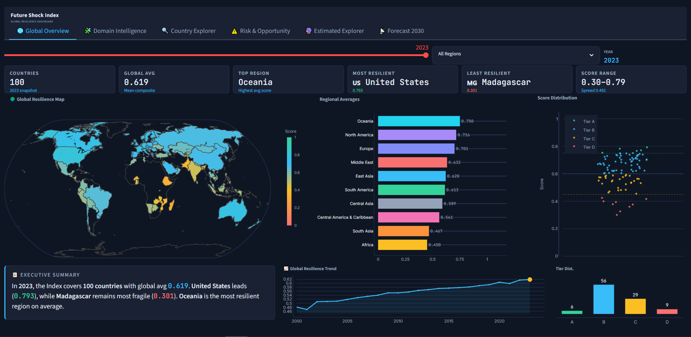
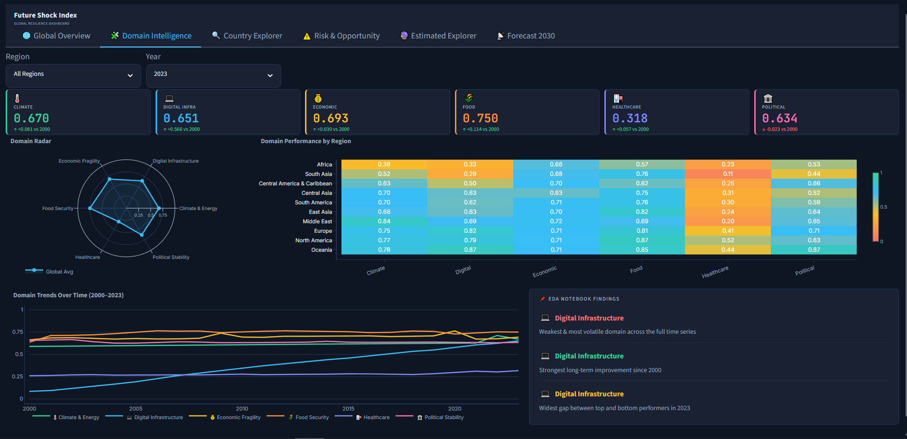
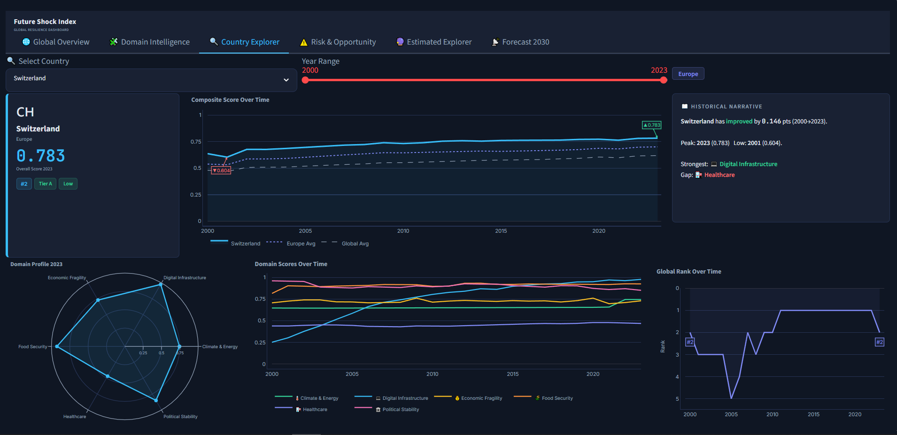
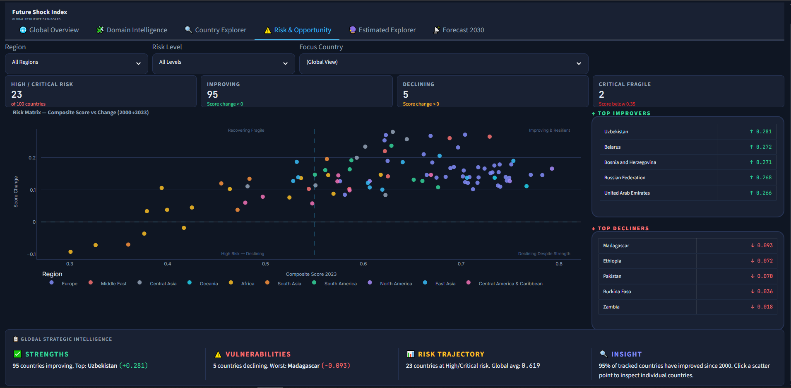
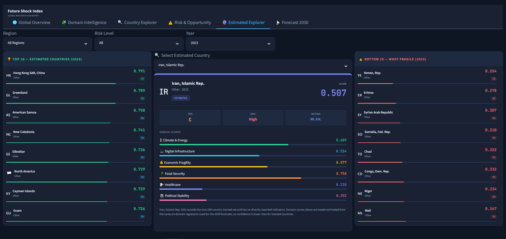
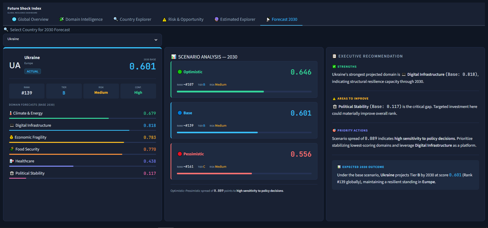

# 🌍 Future Shock Index
### Global Resilience Analysis, Machine Learning & 2030 Forecasting

> An end-to-end Data Analytics and Machine Learning project that measures global resilience across 100 countries, estimates resilience for countries with incomplete data, and forecasts resilience through 2030 using predictive modeling.

---

# 📖 Project Overview

Future Shock Index is an interactive analytics platform designed to measure how resilient countries are against future global shocks.

The project combines:

- Data Cleaning & Preparation
- Exploratory Data Analysis (EDA)
- Composite Index Construction
- Interactive Streamlit Dashboard
- Machine Learning Estimation
- 2030 Forecasting
- Scenario Analysis

---

# 🎯 Objectives

- Build a Global Resilience Index.
- Compare countries and regions.
- Analyze resilience trends from 2000–2023.
- Identify strengths and vulnerabilities.
- Estimate resilience for countries with missing data.
- Forecast resilience through 2030.
- Support strategic decision-making.

---

# 🏛 Resilience Domains

The index is built from six strategic domains:

- 🌍 Climate & Energy
- 💻 Digital Infrastructure
- 💰 Economic Fragility
- 🌾 Food Security
- 🏥 Healthcare
- 🏛 Political Stability

---

# 📊 Dashboard

---

# 🌍 Global Overview



## Insights

- Displays the global resilience snapshot for the selected year.
- Highlights the most and least resilient countries.
- Compares regional average resilience scores.
- Shows the worldwide resilience distribution.
- Tracks the global resilience trend from 2000 to 2023.
- Includes an executive summary of the current global situation.

---

# 🧩 Domain Intelligence



## Insights

- Analyze each resilience domain independently.
- Compare domain performance across world regions.
- Identify the strongest and weakest domains.
- Visualize long-term domain trends.
- Explore regional heatmaps and radar charts.
- Summarizes key findings from the EDA process.

---

# 🔍 Country Explorer



## Insights

- Explore any tracked country individually.
- View historical resilience score evolution.
- Compare with global and regional averages.
- Analyze domain performance over time.
- Monitor global ranking changes.
- Read automatically generated country insights.

---

# ⚠️ Risk & Opportunity



## Insights

- Identify countries at High and Critical Risk.
- Detect improving and declining countries.
- Analyze resilience change since 2000.
- Explore the Risk Matrix.
- View Top Improvers and Top Decliners.
- Summarize strategic global opportunities and vulnerabilities.

---

# 🤖 Estimated Country Explorer



## Insights

Many countries are excluded from the official resilience index because they lack sufficient historical indicators.

Instead of removing them completely, this project applies Machine Learning models to estimate:

- Composite Resilience Score
- Six Domain Scores
- Tier Classification
- Risk Level

Estimated countries are clearly labeled to distinguish them from officially tracked countries while expanding global coverage.

---

# 🚀 Forecast 2030



## Insights

Forecast future resilience using Machine Learning.

The dashboard provides:

- Base Scenario
- Optimistic Scenario
- Pessimistic Scenario
- Forecasted Domain Scores
- Expected Global Rank
- Executive Recommendations
- Risk Assessment

The scenario comparison helps decision-makers understand possible future resilience trajectories.

---

# 🤖 Machine Learning

The Machine Learning pipeline performs two independent tasks.

## 1. Estimated Countries

Countries outside the core dataset are estimated using trained regression models.

Outputs include:

- Composite Score
- Domain Scores
- Tier
- Risk Level

---

## 2. Forecast 2030

Forecasts are generated for every tracked country from 2024 to 2030.

Predictions include:

- Domain Scores
- Composite Score
- Global Rank
- Risk Level
- Tier
- Scenario Analysis

---

# 📁 Module Structure

```text
Python_Analysis&ML&Forecasting_Final_Project
│
├── Images/
│   ├── Overview.png
│   ├── Domain.png
│   ├── Country_Explorer.png
│   ├── Risk.png
│   ├── Estimated_Explorer.png
│   └── Forecast2030.png
│
├── forecast_outputs/
│
├── DASHBOARD.py
├── Global_Resilience_Analysis.ipynb
├── Global_Resilience_ML_Forecast.ipynb
├── requirements.txt
└── README.md
```

---

# ⚙️ Technologies

- Python
- Pandas
- NumPy
- Plotly
- Streamlit
- Scikit-Learn
- Joblib

---

# 🔄 Project Workflow

```text
Raw Data
     │
     ▼
Data Cleaning
     │
     ▼
Feature Engineering
     │
     ▼
Normalization
     │
     ▼
Domain Scores
     │
     ▼
Composite Resilience Index
     │
     ▼
Exploratory Data Analysis
     │
     ▼
Interactive Dashboard
     │
     ├────────► Estimated Countries (Machine Learning)
     │
     └────────► Forecast 2030 (Machine Learning)
```

---

# 🚀 Run Locally

Clone the repository

```bash
git clone https://github.com/mostafaelrkhawy7/Who-survives-the-shock.git
```

Go to the project folder

```bash
cd Python_Analysis&ML&Forecasting_Final_Project
```

Install dependencies

```bash
pip install -r requirements.txt
```

Run the dashboard

```bash
streamlit run DASHBOARD.py
```

---

# ⭐ Key Features

- Interactive Streamlit Dashboard
- Composite Global Resilience Index
- Six-Domain Analytical Framework
- Historical Trend Analysis
- Country Intelligence
- Risk Assessment
- Machine Learning Estimation
- Estimated Country Explorer
- 2030 Forecasting
- Scenario Analysis
- Executive Recommendations

---
