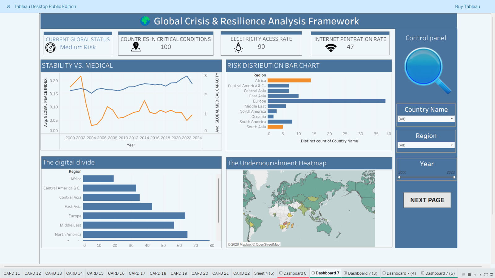
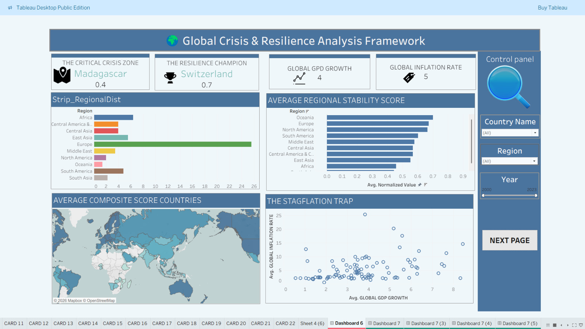
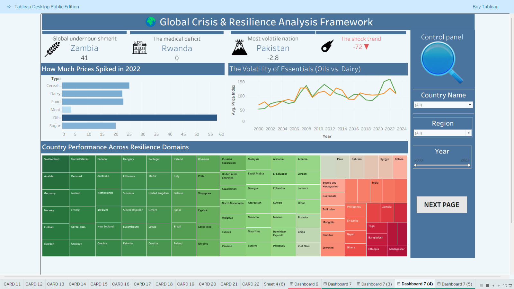
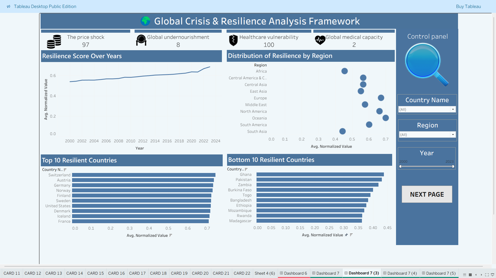
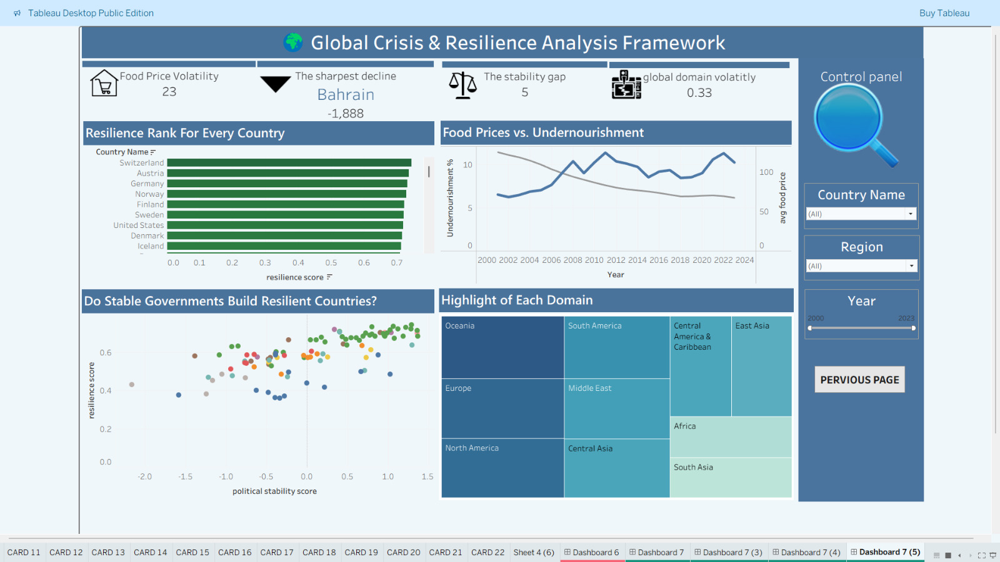

# 🌍 Global Crisis & Resilience Analysis Framework

> An interactive Tableau analytics platform for evaluating global resilience, crisis vulnerability, economic stability, healthcare readiness, digital infrastructure, governance, and food security across more than 180 countries.

---

## 📖 Project Overview

The **Global Crisis & Resilience Analysis Framework** transforms complex global indicators into a unified interactive analytics platform.

By combining multiple international datasets into a standardized resilience framework, the project enables policymakers, analysts, and researchers to identify vulnerable countries, monitor resilience trends, and explore the relationships between economic, healthcare, governance, digital, and food security indicators.

The Tableau dashboards provide an end-to-end storytelling experience, moving from a global overview to deep-dive analyses across different resilience dimensions.

---

# 🚀 Dashboard Navigation

| Dashboard | Focus |
|-----------|------|
| 🌍 Dashboard 1 | Global Overview |
| ⚠ Dashboard 2 | Risk & Vulnerability |
| 🌾 Dashboard 3 | Food Security & Shock Analysis |
| 📈 Dashboard 4 | Resilience Performance |
| 🏛 Dashboard 5 | Governance & Domain Insights |

---

# 🌍 Dashboard 1 — Global Overview

## Purpose

Provides a strategic overview of worldwide resilience and highlights the strongest and weakest regions using composite resilience indicators.

### Key Insights

- Identify the world's most resilient country.
- Detect countries facing critical conditions.
- Compare resilience across global regions.
- Explore the relationship between GDP Growth and Inflation.

### Dashboard Includes

✅ Executive KPI Cards

✅ Regional Stability Analysis

✅ Global Composite Score Map

✅ GDP Growth vs Inflation Analysis

### Dashboard Preview

---

# ⚠ Dashboard 2 — Risk & Vulnerability Analysis

## Purpose

Analyzes countries experiencing elevated crisis exposure through healthcare, infrastructure, and food security indicators.

### Key Insights

- Current Global Risk Level
- Countries in Critical Condition
- Digital Infrastructure Gap
- Medical Capacity vs Stability
- Global Undernourishment Distribution

### Dashboard Includes

✅ Risk Status KPIs

✅ Stability vs Medical Capacity

✅ Digital Divide Analysis

✅ Global Heatmap

### Dashboard Preview

---

# 🌾 Dashboard 3 — Food Security & Shock Analysis

## Purpose

Explores how food price volatility impacts resilience and highlights countries suffering from nutritional and healthcare challenges.

### Key Insights

- Food Price Shock
- Global Undernourishment
- Medical Deficit
- Essential Commodity Volatility

### Dashboard Includes

✅ Food Price Analysis

✅ Commodity Trend Comparison

✅ Country Resilience Treemap

### Dashboard Preview

---

# 📈 Dashboard 4 — Resilience Performance Monitoring

## Purpose

Tracks resilience evolution across years while comparing country and regional performance.

### Key Insights

- Global Resilience Trend
- Regional Performance Comparison
- Top Performing Countries
- Lowest Performing Countries

### Dashboard Includes

✅ Time Series Analysis

✅ Regional Distribution

✅ Top 10 Ranking

✅ Bottom 10 Ranking

### Dashboard Preview

---

# 🏛 Dashboard 5 — Governance & Domain Insights

## Purpose

Examines how governance quality, food security, and domain performance contribute to overall resilience.

### Key Insights

- Political Stability vs Resilience
- Food Prices vs Undernourishment
- Global Country Ranking
- Regional Domain Performance

### Dashboard Includes

✅ Country Ranking

✅ Correlation Analysis

✅ Domain Treemap

### Dashboard Preview

---

# 📊 Analytical Domains

The resilience framework combines indicators from six major domains.

| Domain | Sample Indicators |
|---------|------------------|
| 📈 Economic | GDP Growth, Inflation |
| 🏥 Healthcare | Medical Capacity, Physicians, Hospitals |
| 🌐 Digital Infrastructure | Internet Users, Broadband, Electricity |
| 🏛 Governance | Political Stability |
| 🌾 Food Security | Food Prices, Undernourishment |
| 🌍 Composite Resilience | Domain Scores, Overall Resilience Score |

---

# 🎯 Interactive Features

- 🌍 Global Map Exploration
- 🔍 Country-Level Drill Down
- 🌎 Region Comparison
- 📅 Time Slider (2000–2023)
- 🎛 Interactive Filters
- 📈 Cross Dashboard Storytelling
- 📊 Dynamic KPI Cards

---

# 💡 Business Value

The dashboards support strategic decision-making by enabling users to:

- Identify countries at high risk.
- Compare resilience across regions.
- Detect long-term resilience trends.
- Monitor economic and healthcare vulnerability.
- Understand food security challenges.
- Evaluate governance effectiveness.
- Support policy planning with interactive analytics.

---

# 🛠 Technology Stack

| Tool | Purpose |
|------|----------|
| Tableau Public | Dashboard Development |

---

# 📷 Dashboard Gallery

| Dashboard | Preview |
|-----------|---------|
| Global Overview |  |
| Risk & Vulnerability |  |
| Food Security |  |
| Resilience Monitoring |  |
| Governance Insights |  |

---

# ⭐ Project Highlights

- 5 Interactive Dashboards
- 180+ Countries
- 20+ Global Indicators
- Multi-Domain Resilience Framework
- Interactive Storytelling
- Executive KPI Cards
- Regional Comparison
- Dynamic Filtering
- Geospatial Analytics
- Correlation Analysis
